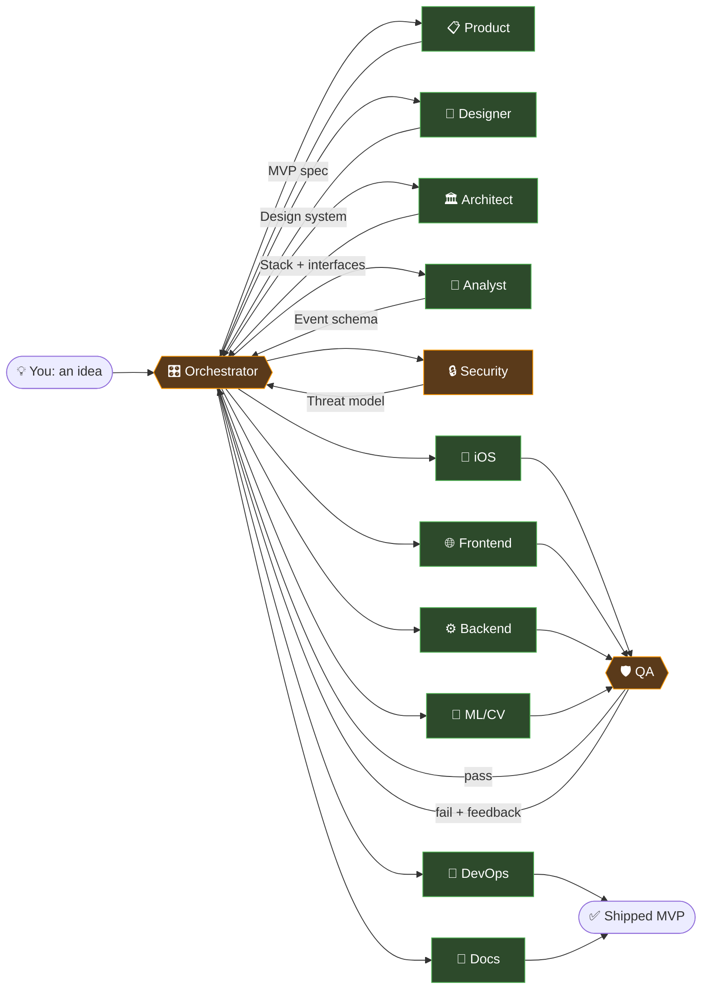
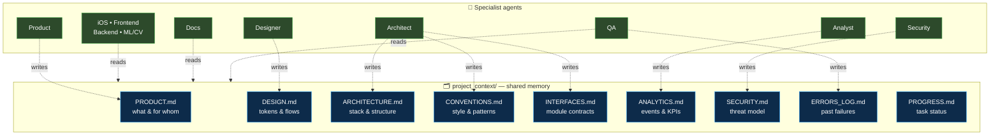
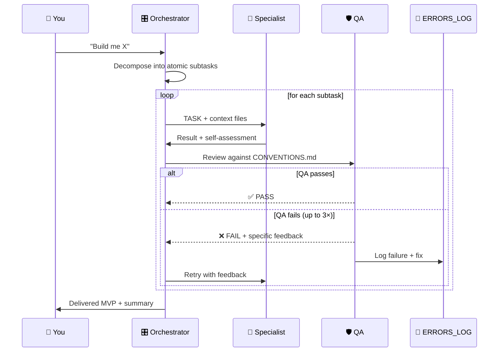

<div align="center">

# 🔨 Forge

### From raw idea to shipped MVP — with a team of specialist AI agents inside Claude Code.

[](./LICENSE)
[](https://claude.com/claude-code)
[](./CONTRIBUTING.md)
[](https://github.com/lionshilov/Forge/actions/workflows/ci.yml)
[](https://github.com/lionshilov/Forge/stargazers)

**Describe what you want. Forge's orchestrator decomposes it, routes each subtask to the right specialist (Product, Designer, Architect, Analyst, Security, iOS, Frontend, Backend, ML/CV, DevOps, QA, Docs), reviews every output, and hands you a working MVP.**

[Quickstart](#-quickstart) • [How it works](#-how-it-works) • [The agents](#-the-agents) • [Examples](./examples/quickstart.md) • [FAQ](#-faq)

</div>

---

## ✨ Why Forge

- 🧠 **One generalist prompt ≠ a team.** Forge gives you *twelve* deep specialists instead of one shallow everything-agent.
- 🗂️ **Shared memory that survives handoffs.** Every agent reads `project_context/` first — nothing gets lost between steps.
- 🛡️ **QA is mandatory, not optional.** No output ships until reviewed against your project's explicit conventions.
- 🔌 **Zero install.** No framework, no runtime — just Markdown prompts and a folder convention. Drop it into any repo.
- 🧩 **Fork-friendly.** Every agent is one file. Swap, tweak, or add specialists in minutes.

---

## 🧭 How it works

### The big picture



### Why it works: shared context

Every agent reads from the same shared brain before starting. That's why handoffs don't leak information.



### What happens to a single task



---

## ⚡ Quickstart

**Prerequisites:** [Claude Code](https://claude.com/claude-code) installed and working.

```bash
# 1. Clone Forge
git clone https://github.com/lionshilov/Forge.git
cd forge

# 2. Bootstrap a new project (copies agents + context into a fresh dir)
./scripts/forge-init.sh ~/code/my-app "My App"

# 3. Open it in Claude Code
cd ~/code/my-app
claude
```

Then in Claude Code, just describe what you want:

> *"Build me a small iOS app that reminds me to drink water based on how active I've been today."*

Claude auto-loads the root `CLAUDE.md` and takes on the **Orchestrator** role. From here, you mostly answer product questions and approve QA verdicts — you're not writing boilerplate.

📖 **Full walkthrough:** [examples/quickstart.md](./examples/quickstart.md)

### Starter templates

Skip the scaffolding and start with a working stack:

```bash
./scripts/forge-init.sh ~/code/my-tool "My Tool" --template vanilla-static
./scripts/forge-init.sh ~/code/my-web  "My Web"  --template nextjs-supabase
./scripts/forge-init.sh ~/code/my-ios  "My iOS" --template swiftui-ios
```

| Template | What you get |
|---|---|
| `vanilla-static` | Single `index.html`, dark theme, GitHub Pages workflow — zero build step |
| `nextjs-supabase` | Next.js 15 App Router + Supabase (SSR), Tailwind, TypeScript strict |
| `swiftui-ios` | SwiftUI MVVM drop-in (`@Observable`), APIClient, Theme tokens |

---

## 🤖 The agents

| Agent | Role | When it runs |
|---|---|---|
| 📋 **Product** | Idea → MVP spec (user stories, scope, metrics) | **First.** Always. |
| 🎨 **Designer** | Design system, flows, tokens, a11y floor | After Product, before any UI is built |
| 🏛️ **Architect** | Tech stack, directory structure, ADRs, interfaces | After Product, before any code |
| 🧪 **Analyst** | Event schema, KPIs, funnels, A/B tests | After Architect, before instrumentation lands |
| 🔒 **Security** | Threat model, auth, secrets, OWASP review | After Architect, re-reviews before ship |
| 📱 **iOS / Swift** | SwiftUI, UIKit, CoreML, HealthKit, async/await | Parallel with other specialists |
| 🌐 **Frontend-Web** | React, Next.js, Vue, Svelte, Tailwind, a11y | Parallel with other specialists |
| ⚙️ **Backend** | REST/GraphQL, Postgres/Redis, auth, Docker | Parallel with other specialists |
| 🧠 **ML / CV** | PyTorch, CoreML, real-time inference pipelines | When models are part of the product |
| 🛡️ **QA** | Reviews every output, logs failures, enforces conventions | After every specialist output |
| 🚀 **DevOps** | CI/CD, Fastlane, TestFlight, Docker deploy | Once there's working code + Security sign-off |
| 📖 **Docs** | README, API docs, changelog, diagrams | Last — after QA approves |

Every agent is one Markdown file under `agents/<name>/CLAUDE.md`. Read it, tweak it, PR it.

---

## 🗂️ Project layout

```
forge/
├── CLAUDE.md                    ← Orchestrator prompt (auto-loaded by Claude Code)
├── README.md
├── LICENSE                      ← MIT
├── CONTRIBUTING.md
├── scripts/
│   └── forge-init.sh            ← Bootstrap a new project
├── project_context/             ← Shared memory templates
│   ├── PRODUCT.md
│   ├── DESIGN.md
│   ├── ARCHITECTURE.md
│   ├── CONVENTIONS.md
│   ├── INTERFACES.md
│   ├── ANALYTICS.md
│   ├── SECURITY.md
│   ├── ERRORS_LOG.md
│   └── PROGRESS.md
├── agents/                      ← One folder per specialist
│   ├── product/
│   ├── designer/
│   ├── architect/
│   ├── analyst/
│   ├── security/
│   ├── ios-swift/
│   ├── frontend-web/
│   ├── backend/
│   ├── ml-cv/
│   ├── devops/
│   ├── qa/
│   └── docs/
├── examples/
│   └── quickstart.md
└── templates/                   ← Stack-specific starters (coming)
```

---

## 🎬 What using Forge actually feels like

You're mostly making **decisions**, not typing code:

```
You:       "An app that reminds me to drink water based on activity."

Orchestrator → Product:    ✍️  Drafts PRODUCT.md, asks you 3 questions
You:                       Answer the questions
Product:                   PRODUCT.md finalized

Orchestrator → Architect:  ✍️  Chooses SwiftUI + HealthKit, writes ARCHITECTURE.md
Orchestrator → Architect:  ✍️  Defines INTERFACES.md (HealthKit reads, notification schedule)

Orchestrator → iOS:        🔨  Implements hydration tracking screen
Orchestrator → QA:         🔍  Flags: missing accessibility labels, line 42
Orchestrator → iOS:        🔨  Fixes issues
Orchestrator → QA:         ✅  Pass

Orchestrator → DevOps:     🚀  Adds Fastlane lane for TestFlight
Orchestrator → Docs:       📖  Writes README

You:                       ⌘B in Xcode — app builds, runs, works.
```

The compounding trick: every agent's output is input for the next, and `ERRORS_LOG.md` means the system *learns across runs*.

---

## 🎯 When to use Forge (and when not to)

### ✅ Great fit
- **Solo founders / indie devs** going 0 → 1 on a new product
- **Hackathons** — full stack in a weekend without burning out
- **Internal tools** — a team of one needs to ship a dashboard Monday
- **Side projects** where you'd otherwise procrastinate on scaffolding

### ⚠️ Probably not worth it
- **Tiny scripts** (< 100 LOC) — just ask Claude directly
- **Large legacy codebases** — the value is in clean-slate scaffolding
- **Hard-deadline production systems** — you still need human code review for security/compliance

---

## 🛠️ Customizing

### Tweak an agent's behavior
Edit `agents/<name>/CLAUDE.md`. The **Anti-Patterns** section has the highest leverage — every line there is a class of bug that won't happen again.

### Add a new specialist
```bash
mkdir agents/android-kotlin
$EDITOR agents/android-kotlin/CLAUDE.md
# Follow the format in any existing agent
```
Then add a row to the table in root `CLAUDE.md` so the Orchestrator knows about it. See [CONTRIBUTING.md](./CONTRIBUTING.md).

### Enforce your house style
Fill in `project_context/CONVENTIONS.md` *before* running Forge on a real project. QA will enforce every rule you put there.

---

## ❓ FAQ

<details>
<summary><b>Is this a framework? A CLI? What do I actually install?</b></summary>

Nothing. Forge is Markdown prompts and a folder convention. The runtime is [Claude Code](https://claude.com/claude-code). `forge-init.sh` is a 30-line bash script that copies files.
</details>

<details>
<summary><b>Does this work with Cursor / Windsurf / other AI IDEs?</b></summary>

It's designed for Claude Code because it relies on the root `CLAUDE.md` auto-loading convention. Adapting to Cursor rules or Windsurf is straightforward — PRs welcome.
</details>

<details>
<summary><b>How does the Orchestrator actually "delegate" if it's all one Claude session?</b></summary>

It switches role by reading the target agent's `CLAUDE.md` into context before each subtask. You can also spawn genuine subagents via Claude Code's Agent tool — the routing rules in root `CLAUDE.md` stay identical.
</details>

<details>
<summary><b>Why Mermaid diagrams in the README?</b></summary>

GitHub renders them natively, they version-control cleanly, and they stay in sync with the prompts. No PNGs to rot.
</details>

<details>
<summary><b>Can I use this commercially?</b></summary>

Yes — MIT license. Use it, fork it, ship with it. Stars and PRs appreciated but not required.
</details>

<details>
<summary><b>What if QA keeps failing the same task?</b></summary>

After 3 retries the Orchestrator escalates to you. Usually it means `PRODUCT.md` or `INTERFACES.md` is too vague — tighten them and the agent unblocks.
</details>

---

## 🤝 Contributing

We'd love your help — especially:

- 🆕 **New agents** (Android, Game dev, Rust/systems, SRE, Growth/ASO, Data Engineering)
- 📦 **Templates** for common stacks (Next.js + Supabase, FastAPI + Postgres, etc.)
- 🐛 **Anti-pattern PRs** — found a failure mode? Add it to an agent's blocklist.
- 📖 **Examples** — real projects built with Forge

Read [CONTRIBUTING.md](./CONTRIBUTING.md) first. Issues are open for discussion.

---

## 📜 License

[MIT](./LICENSE) — use it, fork it, ship with it.

---

<div align="center">

**If Forge helps you ship something, [star the repo](#) ⭐ — it's the single biggest way to help the project grow.**

Made for builders who'd rather decide than type.

</div>
