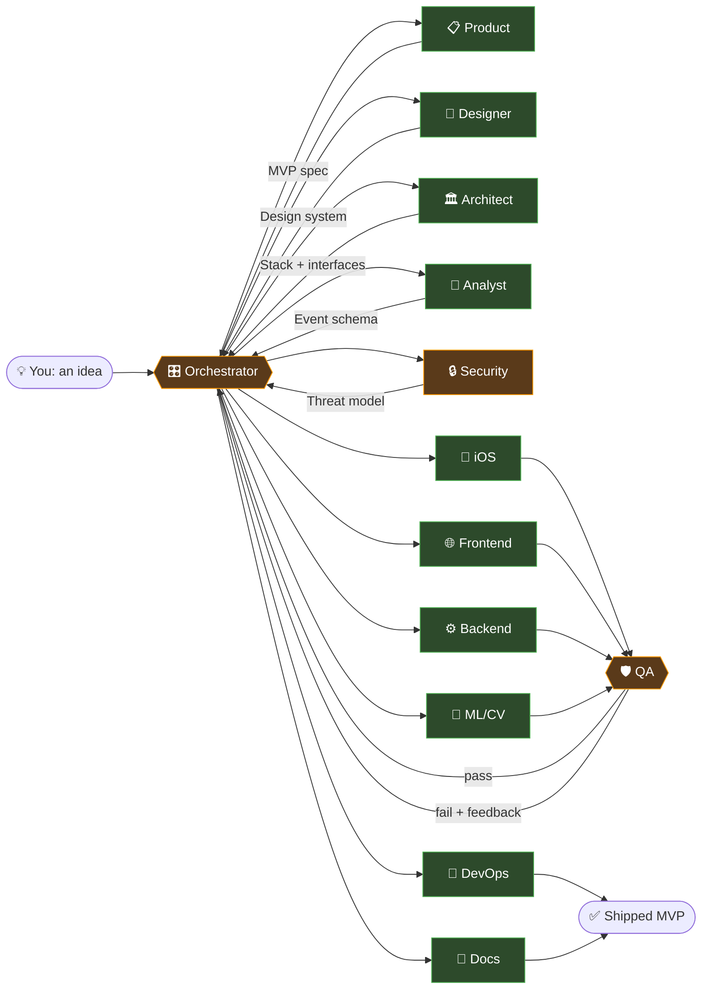
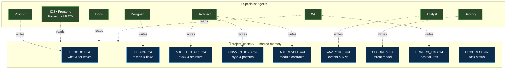
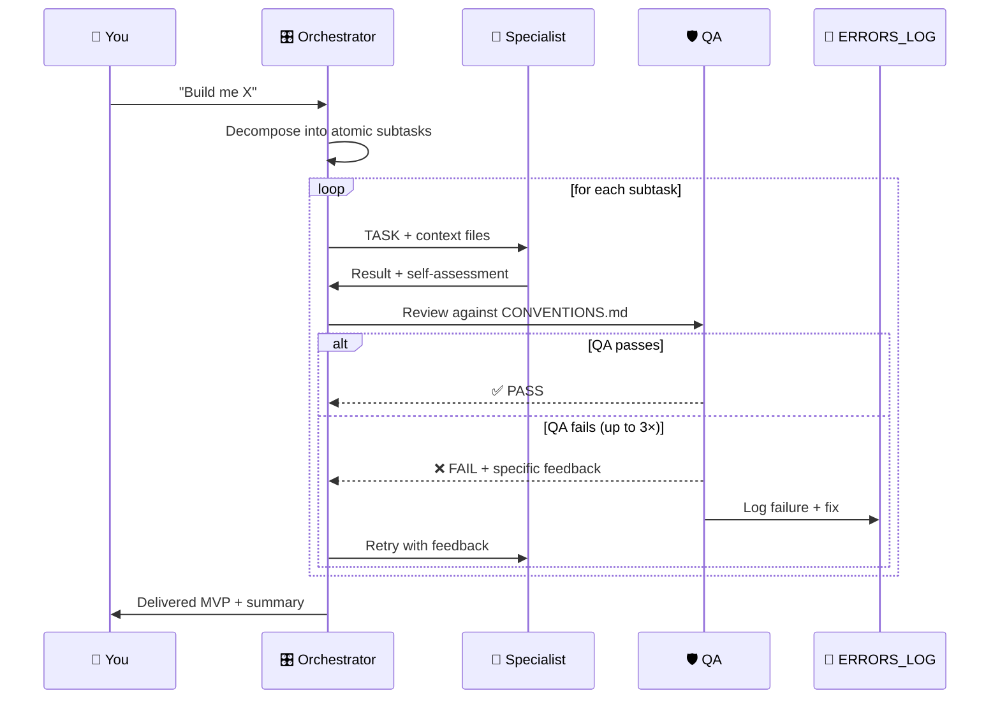

<div align="center">

# 🔨 Forge

### From raw idea to shipped MVP — with a team of specialist AI agents inside Claude Code.

[](./LICENSE)
[](https://claude.com/claude-code)
[](./CONTRIBUTING.md)
[](https://github.com/lionshilov/Forge/actions/workflows/ci.yml)
[](https://github.com/lionshilov/Forge/stargazers)

**Describe what you want. Forge's orchestrator decomposes it, routes each subtask to the right specialist (Product, Designer, Architect, Analyst, Security, iOS, Frontend, Backend, ML/CV, DevOps, QA, Docs), reviews every output, and hands you a working MVP.**

[Quickstart](#-quickstart) • [How it works](#-how-it-works) • [The agents](#-the-agents) • [Examples](./examples/quickstart.md) • [FAQ](#-faq)

</div>

---

## ✨ Why Forge

- 🧠 **One generalist prompt ≠ a team.** Forge gives you *twelve* deep specialists instead of one shallow everything-agent.
- 🗂️ **Shared memory that survives handoffs.** Every agent reads `project_context/` first — nothing gets lost between steps.
- 🛡️ **QA is mandatory, not optional.** No output ships until reviewed against your project's explicit conventions.
- ⌨️ **The loop is one keystroke away.** `/forge-status`, `/forge-task`, `/forge-qa`, `/forge-ship`, `/forge-retro` — the whole workflow ships as slash commands.
- 🚦 **Rules enforced by the harness, not by hope.** Phase gates block an implementation agent until the spec, design, and architecture it builds on are marked `ready` — the routing rules hold even when the model forgets them.
- 🔒 **Guardrails checked in.** Shared `.claude/settings.json` denies agents access to `.env`, keys, and secrets; a session hook loads the gate board and open tasks so no session starts blind.
- 🔌 **Zero install.** No framework, no runtime — just Markdown prompts and a folder convention. Drop it into any repo.
- 🧩 **Fork-friendly.** Every agent is one file. Swap, tweak, or add specialists in minutes. `AGENTS.md` makes it portable to Cursor, Codex & friends.

---

## 🧭 How it works

### The big picture


```mermaid
flowchart LR
    You([💡 You: an idea])
    You --> O{{🎛️ Orchestrator}}

    O --> P[📋 Product]
    P -->|MVP spec| O

    O --> DS[🎨 Designer]
    DS -->|Design system| O

    O --> A[🏛️ Architect]
    A -->|Stack + interfaces| O

    O --> AN[🧪 Analyst]
    AN -->|Event schema| O

    O --> SEC[🔒 Security]
    SEC -->|Threat model| O

    O --> iOS[📱 iOS]
    O --> FE[🌐 Frontend]
    O --> BE[⚙️ Backend]
    O --> ML[🧠 ML/CV]

    iOS --> QA
    FE --> QA
    BE --> QA
    ML --> QA

    QA{{🛡️ QA}} -->|pass| O
    QA -->|fail + feedback| O

    O --> DO[🚀 DevOps]
    O --> D[📖 Docs]
    DO --> Done([✅ Shipped MVP])
    D --> Done

    classDef phase fill:#1a1a1a,stroke:#555,color:#fff
    classDef agent fill:#2d4a2b,stroke:#4caf50,color:#fff
    classDef review fill:#5a3a1a,stroke:#ff9800,color:#fff
    class O,QA,SEC review
    class P,DS,A,AN,iOS,FE,BE,ML,DO,D agent
```

### Why it works: shared context

Every agent reads from the same shared brain before starting. That's why handoffs don't leak information.


```mermaid
flowchart TB
    subgraph ctx["🗂️ project_context/ — shared memory"]
        PRD[PRODUCT.md<br/>what & for whom]
        DSG[DESIGN.md<br/>tokens & flows]
        ARCH[ARCHITECTURE.md<br/>stack & structure]
        CONV[CONVENTIONS.md<br/>style & patterns]
        INT[INTERFACES.md<br/>module contracts]
        ANA[ANALYTICS.md<br/>events & KPIs]
        SECM[SECURITY.md<br/>threat model]
        ERR[ERRORS_LOG.md<br/>past failures]
        PRG[PROGRESS.md<br/>task status]
    end

    subgraph agents["🤖 Specialist agents"]
        direction LR
        P[Product]
        DS[Designer]
        A[Architect]
        AN[Analyst]
        SEC[Security]
        SPEC[iOS • Frontend<br/>Backend • ML/CV]
        Q[QA]
        DOC[Docs]
    end

    P -.writes.-> PRD
    DS -.writes.-> DSG
    A -.writes.-> ARCH & CONV & INT
    AN -.writes.-> ANA
    SEC -.writes.-> SECM
    Q -.writes.-> ERR
    SPEC -.reads.-> ctx
    DOC -.reads.-> ctx
    Q -.reads.-> ctx

    classDef ctxFile fill:#0d2b4a,stroke:#2196f3,color:#fff
    classDef agentNode fill:#2d4a2b,stroke:#4caf50,color:#fff
    class PRD,DSG,ARCH,CONV,INT,ANA,SECM,ERR,PRG ctxFile
    class P,DS,A,AN,SEC,SPEC,Q,DOC agentNode
```

### What happens to a single task


```mermaid
sequenceDiagram
    participant U as 👤 You
    participant O as 🎛️ Orchestrator
    participant S as 🤖 Specialist
    participant Q as 🛡️ QA
    participant E as 📝 ERRORS_LOG

    U->>O: "Build me X"
    O->>O: Decompose into atomic subtasks
    loop for each subtask
        O->>S: TASK + context files
        S->>O: Result + self-assessment
        O->>Q: Review against CONVENTIONS.md
        alt QA passes
            Q-->>O: ✅ PASS
        else QA fails (up to 3×)
            Q-->>O: ❌ FAIL + specific feedback
            Q->>E: Log failure + fix
            O->>S: Retry with feedback
        end
    end
    O->>U: Delivered MVP + summary
```

---

## ⚡ Quickstart

**Prerequisites:** [Claude Code](https://claude.com/claude-code) installed and working.

```bash
# 1. Clone Forge
git clone https://github.com/lionshilov/Forge.git
cd forge

# 2. Bootstrap a new project (copies agents + context into a fresh dir)
./scripts/forge-init.sh ~/code/my-app "My App"

# 3. Open it in Claude Code
cd ~/code/my-app
claude
```

Then in Claude Code, just describe what you want:

> *"Build me a small iOS app that reminds me to drink water based on how active I've been today."*

Claude auto-loads the root `CLAUDE.md` and takes on the **Orchestrator** role. From here, you mostly answer product questions and approve QA verdicts — you're not writing boilerplate.

📖 **Full walkthrough:** [examples/quickstart.md](./examples/quickstart.md)

### Starter templates

Skip the scaffolding and start with a working stack:

```bash
./scripts/forge-init.sh ~/code/my-tool "My Tool" --template vanilla-static
./scripts/forge-init.sh ~/code/my-web  "My Web"  --template nextjs-supabase
./scripts/forge-init.sh ~/code/my-ios  "My iOS" --template swiftui-ios
./scripts/forge-init.sh ~/code/my-api  "My API" --template fastapi-postgres
```

| Template | What you get |
|---|---|
| `vanilla-static` | Single `index.html`, dark theme, GitHub Pages workflow — zero build step |
| `nextjs-supabase` | Next.js 15 App Router + Supabase (SSR), Tailwind, TypeScript strict |
| `swiftui-ios` | SwiftUI MVVM drop-in (`@Observable`), APIClient, Theme tokens |
| `fastapi-postgres` | Async FastAPI + SQLAlchemy 2.0 + Postgres (docker-compose), pytest, ruff |

---

## 🤖 The agents

| Agent | Role | When it runs |
|---|---|---|
| 📋 **Product** | Idea → MVP spec (user stories, scope, metrics) | **First.** Always. |
| 🎨 **Designer** | Design system, flows, tokens, a11y floor | After Product, before any UI is built |
| 🏛️ **Architect** | Tech stack, directory structure, ADRs, interfaces | After Product, before any code |
| 🧪 **Analyst** | Event schema, KPIs, funnels, A/B tests | After Architect, before instrumentation lands |
| 🔒 **Security** | Threat model, auth, secrets, OWASP review | After Architect, re-reviews before ship |
| 📱 **iOS / Swift** | SwiftUI, UIKit, CoreML, HealthKit, async/await | Parallel with other specialists |
| 🌐 **Frontend-Web** | React, Next.js, Vue, Svelte, Tailwind, a11y | Parallel with other specialists |
| ⚙️ **Backend** | REST/GraphQL, Postgres/Redis, auth, Docker | Parallel with other specialists |
| 🧠 **ML / CV** | PyTorch, CoreML, real-time inference pipelines | When models are part of the product |
| 🛡️ **QA** | Reviews every output, logs failures, enforces conventions | After every specialist output |
| 🚀 **DevOps** | CI/CD, Fastlane, TestFlight, Docker deploy | Once there's working code + Security sign-off |
| 📖 **Docs** | README, API docs, changelog, diagrams | Last — after QA approves |

Every agent is one Markdown file under `agents/<name>/CLAUDE.md`. Read it, tweak it, PR it.

### Dispatch: role-switch vs subagent

All 12 agents are registered as Claude Code subagents in `.claude/agents/`; the Orchestrator picks the mode per task:

- **role-switch** (default for Product, Designer, Architect, Analyst, Security, Docs) — Orchestrator reads the agent's prompt into the current context. Cheap, visible, and keeps the live dialog: Product can ask you clarifying questions directly.
- **subagent** (default for iOS, Frontend-Web, Backend, ML/CV, QA, DevOps) — Orchestrator calls Claude Code's `Task` tool with `subagent_type: "<name>"`, registered in `.claude/agents/<name>.md`. Each subagent runs in an isolated context with scoped tools, which means:
  - Heavy code generation doesn't clog the main thread
  - Frontend + Backend can run in parallel
  - QA is *read-only* by design — it literally cannot patch the code under review
  - DevOps tool scope is constrained separately from Backend

The strategy agents can also run as subagents when no live dialog is needed (the brief is complete, or several strategy tasks run in parallel). Since an isolated subagent can't ask you anything, their registrations enforce one rule: **return open questions instead of inventing answers** — the Orchestrator relays them and re-dispatches.

Both modes read from the same `project_context/` — handoffs are still consistent.

### The loop as slash commands

Every phase of the loop is invocable directly — no need to re-explain the workflow to Claude:

| Command | What it does |
|---|---|
| `/forge-status` | Gate board + task board + recent failures + git reality check; recommends the next action |
| `/forge-task <desc>` | Decomposes a feature into atomic subtasks, records them in `PROGRESS.md`, dispatches |
| `/forge-qa [scope]` | Independent review via the read-only `qa` subagent; enforces the pass/fail loop |
| `/forge-ship` | Pre-ship gate: Security re-review → DevOps → Docs |
| `/forge-retro` | Distills session lessons into `ERRORS_LOG.md` / `CONVENTIONS.md` — the system learns |

### Guardrails & continuity, checked in

`.claude/settings.json` and `.claude/hooks/` ship with the project (and into everything `forge-init.sh` bootstraps):

- **Phase gates** — the Routing Rules are enforced by a `PreToolUse` hook instead of being left to the model's memory. Each spec file in `project_context/` opens with `status: template → draft → ready` (or `n/a`) front matter, set by the agent that owns it. Dispatching an agent whose prerequisites aren't `ready` is blocked, and the block tells the Orchestrator exactly which files and owners to route to:

  ```
  Forge gate closed: the ios-swift agent can't start yet — its prerequisites in project_context/ aren't ready (Routing Rules, root CLAUDE.md):
    ✗ DESIGN.md — draft (owner: designer)
  ```

  Skipping a gate is possible, but only as the user's explicit decision, recorded with a reason (`FORGE_GATES=off` turns enforcement off for a session). The gate script is plain bash with a test suite — `./scripts/test-forge-gate.sh` — and other AI tools can run the same check: `bash .claude/hooks/forge-gate.sh check <agent>`.
- **Secret hygiene** — agents are denied `Read` access to `.env`, `.env.local`, `*.pem`, `*.key`, `secrets/**`. (`.env.example` stays readable on purpose.)
- **Session continuity** — a `SessionStart` hook injects the gate board, every open task from `PROGRESS.md`, and the latest `ERRORS_LOG.md` entries, so a fresh session resumes where the last one stopped instead of starting blind:

  ```
  ── Forge session board (auto-loaded by .claude/hooks/forge-gate.sh) ──
  Phase gates — status: in project_context/ front matter (template → draft → ready | n/a):
    ✓ PRODUCT.md       ready
    ✗ DESIGN.md        draft     owner: designer   → blocks ios-swift, frontend-web
    ✓ ARCHITECTURE.md  ready
    ✓ CONVENTIONS.md   ready
    ✓ INTERFACES.md    ready
    ✗ ANALYTICS.md     template  owner: analyst
    ✗ SECURITY.md      template  owner: security   → blocks devops
  Tasks (PROGRESS.md): 4 total — 🟢 2 done · 🟡 1 in progress · 🔁 0 in review · 🔴 0 blocked · ❌ 0 failed · ⚪ 1 not started
  | T-03 | Reminder scheduler | ios-swift | ⚪ | T-02 | gated on DESIGN.md |
  | T-04 | Design tokens + onboarding flow | designer | 🟡 | T-01 | 1 question for the user |
  Errors (ERRORS_LOG.md): none logged
  ```

---

## 🗂️ Project layout

```
forge/
├── CLAUDE.md                    ← Orchestrator prompt (auto-loaded by Claude Code)
├── AGENTS.md                    ← Same system for other AI tools (agents.md standard)
├── README.md
├── LICENSE                      ← MIT
├── CONTRIBUTING.md
├── scripts/
│   └── forge-init.sh            ← Bootstrap a new project
├── project_context/             ← Shared memory templates
│   ├── PRODUCT.md
│   ├── DESIGN.md
│   ├── ARCHITECTURE.md
│   ├── CONVENTIONS.md
│   ├── INTERFACES.md
│   ├── ANALYTICS.md
│   ├── SECURITY.md
│   ├── ERRORS_LOG.md
│   └── PROGRESS.md
├── .claude/
│   ├── settings.json            ← Shared guardrails: secret deny-rules + hooks
│   ├── hooks/forge-gate.sh      ← Phase gates (PreToolUse) + session board (SessionStart)
│   ├── skills/                  ← Slash commands: /forge-status, -task, -qa, -ship, -retro
│   └── agents/                  ← All 12 agents registered as Claude Code subagents
│       ├── product.md …         ← strategy agents (model: inherit) — role-switch
│       │                          by default, subagent when no dialog needed
│       ├── ios-swift.md …       ← implementation agents (model: sonnet) —
│       │                          isolated context via Task tool
│       └── qa.md                ← read-only by design (CI enforces it)
├── agents/                      ← One folder per specialist (full prompts)
│   ├── product/
│   ├── designer/
│   ├── architect/
│   ├── analyst/
│   ├── security/
│   ├── ios-swift/
│   ├── frontend-web/
│   ├── backend/
│   ├── ml-cv/
│   ├── devops/
│   ├── qa/
│   └── docs/
├── examples/
│   └── quickstart.md
└── templates/                   ← Stack-specific starters (coming)
```

---

## 🎬 What using Forge actually feels like

You're mostly making **decisions**, not typing code:

```
You:       "An app that reminds me to drink water based on activity."

Orchestrator → Product:    ✍️  Drafts PRODUCT.md (status: draft), asks you 3 questions
You:                       Answer the questions
Product:                   PRODUCT.md → status: ready

Orchestrator → Designer:   🎨  Tokens, screens, a11y floor → DESIGN.md ready
Orchestrator → Architect:  ✍️  Chooses SwiftUI + HealthKit, writes ARCHITECTURE.md
Orchestrator → Architect:  ✍️  Defines INTERFACES.md (HealthKit reads, notification schedule)
Orchestrator → Security:   🔒  Threat model: health data stays on-device → SECURITY.md

Orchestrator → iOS:        🚦  Gate open (spec, design, architecture ready)
Orchestrator → iOS:        🔨  Implements hydration tracking screen
Orchestrator → QA:         🔍  Flags: missing accessibility labels, line 42
Orchestrator → iOS:        🔨  Fixes issues
Orchestrator → QA:         ✅  Pass

Orchestrator → DevOps:     🚀  Adds Fastlane lane for TestFlight
Orchestrator → Docs:       📖  Writes README

You:                       ⌘B in Xcode — app builds, runs, works.
```

The compounding trick: every agent's output is input for the next, and `ERRORS_LOG.md` means the system *learns across runs*.

---

## 🎯 When to use Forge (and when not to)

### ✅ Great fit
- **Solo founders / indie devs** going 0 → 1 on a new product
- **Hackathons** — full stack in a weekend without burning out
- **Internal tools** — a team of one needs to ship a dashboard Monday
- **Side projects** where you'd otherwise procrastinate on scaffolding

### ⚠️ Probably not worth it
- **Tiny scripts** (< 100 LOC) — just ask Claude directly
- **Large legacy codebases** — the value is in clean-slate scaffolding
- **Hard-deadline production systems** — you still need human code review for security/compliance

---

## 🛠️ Customizing

### Tweak an agent's behavior
Edit `agents/<name>/CLAUDE.md`. The **Anti-Patterns** section has the highest leverage — every line there is a class of bug that won't happen again.

### Add a new specialist
```bash
mkdir agents/android-kotlin
$EDITOR agents/android-kotlin/CLAUDE.md
# Follow the format in any existing agent
```
Then add a row to the table in root `CLAUDE.md` so the Orchestrator knows about it, register it in `.claude/agents/`, and give it prerequisites in the `RULES` table of `.claude/hooks/forge-gate.sh` — CI fails if any of the four drift apart. See [CONTRIBUTING.md](./CONTRIBUTING.md).

### Enforce your house style
Fill in `project_context/CONVENTIONS.md` *before* running Forge on a real project. QA will enforce every rule you put there.

---

## ❓ FAQ

<details>
<summary><b>Is this a framework? A CLI? What do I actually install?</b></summary>

Nothing. Forge is Markdown prompts and a folder convention. The runtime is [Claude Code](https://claude.com/claude-code). `forge-init.sh` is a 30-line bash script that copies files.
</details>

<details>
<summary><b>Does this work with Cursor / Windsurf / other AI IDEs?</b></summary>

Yes, in role-switch mode. Forge ships an [`AGENTS.md`](./AGENTS.md) (the [agents.md](https://agents.md) open standard read by Cursor, Codex, Zed and others) that tells any AI agent how to run the system: adopt the Orchestrator role from `CLAUDE.md`, dispatch by reading `agents/<name>/CLAUDE.md` into context, keep `project_context/` honest. Claude Code additionally gets isolated subagents, slash commands, and hooks — those are runtime-specific.
</details>

<details>
<summary><b>How does the Orchestrator actually "delegate" if it's all one Claude session?</b></summary>

Two modes, picked per task:

1. **Role-switch** (default for Product, Designer, Architect, Analyst, Security, Docs) — Orchestrator reads `agents/<name>/CLAUDE.md` into the current context and continues in that role. One session, visible in the main thread.
2. **Subagent** (default for iOS, Frontend, Backend, ML, QA, DevOps) — Orchestrator calls Claude Code's `Task` tool with the matching `subagent_type`. Subagents are registered in `.claude/agents/<name>.md` with YAML frontmatter (name, tools, model). They run in isolated contexts with scoped tools and return a summary. QA is locked to read-only this way — it cannot silently modify the code it's reviewing.

Both modes read the same `project_context/*.md` files, so handoffs stay consistent regardless of which mode was used.
</details>

<details>
<summary><b>Why Mermaid diagrams in the README?</b></summary>

GitHub renders them natively, they version-control cleanly, and they stay in sync with the prompts. No PNGs to rot.
</details>

<details>
<summary><b>Can I use this commercially?</b></summary>

Yes — MIT license. Use it, fork it, ship with it. Stars and PRs appreciated but not required.
</details>

<details>
<summary><b>What if QA keeps failing the same task?</b></summary>

After 3 retries the Orchestrator escalates to you. Usually it means `PRODUCT.md` or `INTERFACES.md` is too vague — tighten them and the agent unblocks.
</details>

---

## 🤝 Contributing

We'd love your help — especially:

- 🆕 **New agents** (Android, Game dev, Rust/systems, SRE, Growth/ASO, Data Engineering)
- 📦 **Templates** for common stacks (Next.js + Supabase, FastAPI + Postgres, etc.)
- 🐛 **Anti-pattern PRs** — found a failure mode? Add it to an agent's blocklist.
- 📖 **Examples** — real projects built with Forge

Read [CONTRIBUTING.md](./CONTRIBUTING.md) first. Issues are open for discussion.

---

## 📜 License

[MIT](./LICENSE) — use it, fork it, ship with it.

---

<div align="center">

**If Forge helps you ship something, [star the repo](#) ⭐ — it's the single biggest way to help the project grow.**

Made for builders who'd rather decide than type.

</div>
